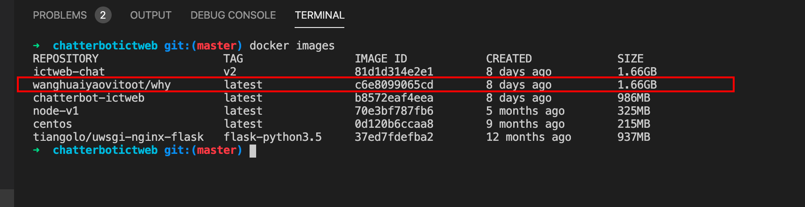
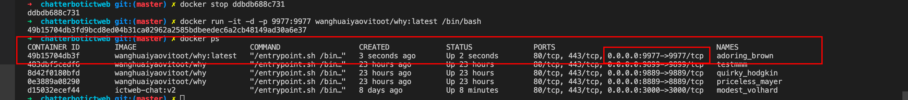
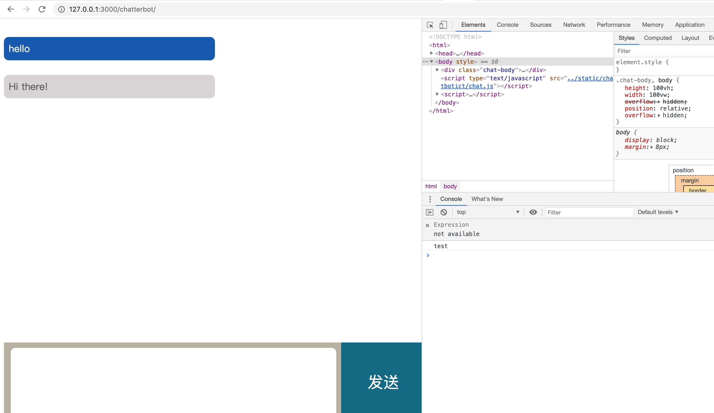
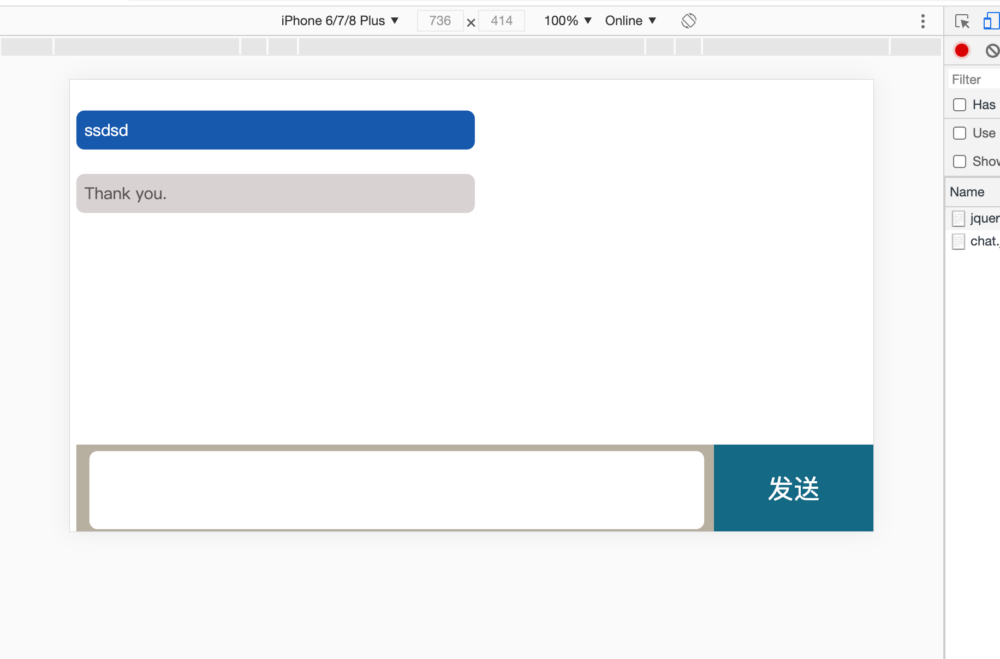

### 将项目文件复制容器

docker cp /Users/huaiyaowang/why/sidework/chatterbotictweb d15032ecef44:/www/

### 进入容器

docker exec -it d15032ecef44 /bin/bash

python manage.py runserver 0.0.0.0:3000


## 开发文档

### 拉去代码

```
git clone git@github.com:cogimira/ictchattbot.git

或者

git clone https://github.com/cogimira/ictchattbot.git


```

### clone 完成进入项目根目录

```
cd ictchattbot

```

进入根目录后运行  ``` pwd ``` 可以查看项目的绝对路径

### 拉取docker 镜像

```
docker pull wanghuaiyaovitoot/why:latest
```

### 查看容器是否拉取成功

> 显示下列红框信息说明镜像拉取成功了




```
docker images
```

### 根据镜像启动容器

> 下面已 9977 端口为例

```
docker run -it -d -p 9977:9977 wanghuaiyaovitoot/why:latest /bin/bash
```

### 查看容器是否启动成功

> 运行命令
```
docker ps
```


发现红框信息说明容器已经启动成功了


## 如何开发

开发之前需要先获取如下信息

1: 项目绝对路径 例我的项目路径为  ```/Users/huaiyaowang/why/sidework/chatterbotictweb```

2: 容器id 例我的 ```d15032ecef44```

3: 需要映射的端口 例我的端口为```3000```

```
docker cp ${项目绝对路径} ${容器id}:/www/ && docker stop ${容器id} && docker restart ${容器id} && docker exec -it ${容器id}  /bin/bash  -c  'cd /www/chatterbotictweb && python manage.py runserver 0.0.0.0:${开放端口}'
```

4: 将```${}```中的信息替换为自己的信息


> 下面是我本机的例子

```
docker cp /Users/huaiyaowang/why/sidework/chatterbotictweb d15032ecef44:/www/ && docker stop d15032ecef44 && docker restart d15032ecef44 && docker exec -it d15032ecef44  /bin/bash  -c  'cd /www/chatterbotictweb && python manage.py runserver 0.0.0.0:3000'
```

### 打开浏览器访问

```
http://127.0.0.1:3000/chatterbot/
```



## 项目部署

> 将代码推送到远程master分支


> 登陆服务器


> 运行下面的命令

 ```cd /var/www/ictchattbot && git pull && docker cp /var/www/ictchattbot 62471f686883:/www/ && docker stop 62471f686883 && docker restart 62471f686883 && docker exec -it 62471f686883  /bin/bash  -c  'cd /www/ictchattbot && python manage.py runserver 0.0.0.0:7777'```

> 访问地址

```http://classlinkr.com/chatterbot/```

